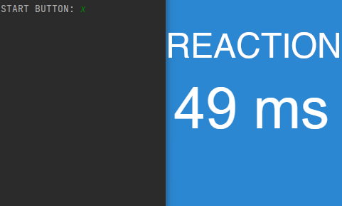

# FCLICK
Script that clicks left mouse button when it detects a color change in a given pixel. Just run the script, select the key you want to run the program with, then point the cursor to the pixel you want to click when it changes color and push the previously selected key. When the pixel changes color, the script automatically clicks it.<br/>
<br/>


# Installation
You will need these packages to run FCLICK:
* pyautogui
* keyboard
* pywin32

To install required packages run:
```
pip install -r requirements.txt
```

# Usage
1. Run FCLICK
2. Select button you want to start FCLICK with
3. Put cursor on the pixel that you want to click when it changes color
4. Click selected start button

# Author
Filip Rokita<br/>
www.filiprokita.com
